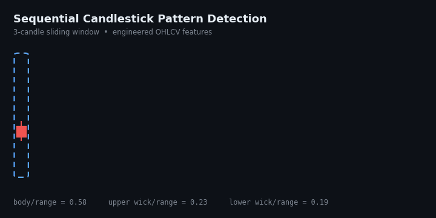

# Sequential Candle Patterns



## Overview

**Sequential Candle Patterns** is an ML-based framework for identifying recurring candlestick formations from **OHLCV market data**. The project combines deterministic technical definitions with supervised learning to investigate whether sequential price-action structures can be represented and recognized from numerical market data.

## Methodology

### 1. Feature Engineering
Raw OHLCV data is transformed into candle-level features describing **body size, price range, upper/lower shadows, candle direction, and relative price movements**.

### 2. Pattern Detection & Labeling
A rule-based detector identifies predefined single- and multi-candle formations from sequential observations. These detections provide structured reference labels for the ML pipeline.

### 3. ML Recognition
Sequential candle features are used to train a **Gradient Boosting Classifier** as a baseline recognition model. The model is evaluated using holdout and cross-validation to assess generalization.

```text
OHLCV Data
    ↓
Candle Feature Engineering
    ↓
Sequential Window Construction
    ↓
Rule-Based Pattern Detection
    ↓
Pattern Labels
    ↓
ML Classification
    ↓
Performance & Error Analysis
```

## Baseline Results

| Metric | Result |
|---|---:|
| Holdout Accuracy | **71.05%** |
| ROC-AUC | **0.7333** |

Five-fold cross-validation was additionally used to assess model stability beyond a single train/test split.

## Technical Direction

The project is being extended from numerical classification toward **visual and representation-based pattern recognition**, including:

- CNN-based candlestick recognition
- **Grad-CAM** for model interpretability
- Data augmentation for pattern invariance
- Robustness testing under controlled perturbations
- Comparison of sequential and visual representations

## Technology

**Python · Pandas · NumPy · Scikit-learn · PyTorch · Matplotlib**

## Disclaimer

This project is intended for **machine learning research and experimentation**. Model outputs are not financial advice and are not presented as evidence of trading profitability.
